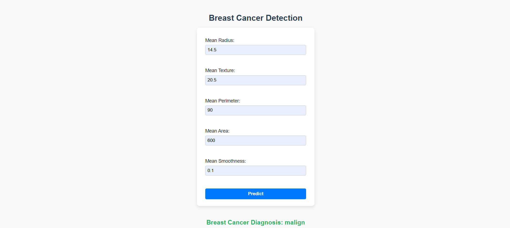

# Breast Cancer Detection Project 🎗️🔬🤖

## Description 📝

This project uses **Logistic Regression** to predict whether a tumor is malignant or benign based on features from the breast cancer dataset. It aids in early diagnosis and can help improve patient outcomes. 🏥❤️

## Features ✨

- Data preprocessing and feature scaling 🔧  
- Logistic Regression model for binary classification 🎯  
- Flask web app for user-friendly input and prediction 🌐🖥️  
- Instant prediction results based on user input 📝⚡  

## Technologies Used 🛠️

- Python 🐍  
- scikit-learn 🔍  
- Flask 🚀  
- HTML & CSS 🎨  

## How to Run 💻

1. Clone the repository 📥 
   git clone https://github.com/suhanakesharwani/breast-cancer-detection.git
   cd breast-cancer-detection

2. Install dependencies:
    pip install -r requirements.txt

3. Run the Flask app for prediction UI:
    python app.py

4. Open your browser and go to http://127.0.0.1:5000 to use the app 🖱️

## Author ✍️

Made with ❤️ by **Suhana Kesharwani**  
Feel free to connect and reach out!  

- Email: suhanakesharwani@gmail.com
- LinkedIn: https://www.linkedin.com/in/suhana-kesharwani-b11044326  
- GitHub: https://github.com/suhanakesharwani 

Looking forward to collaborating and learning together! 🚀

